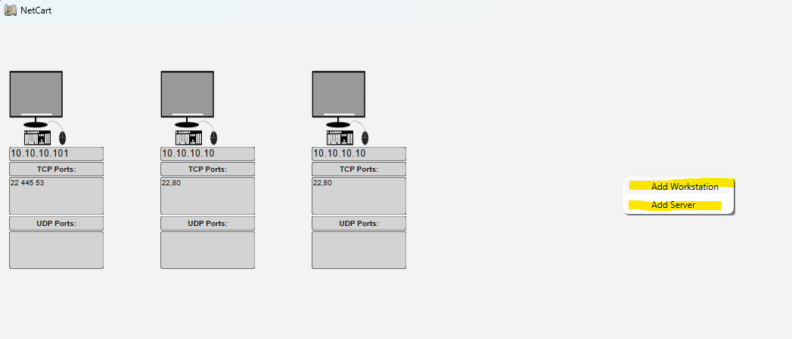
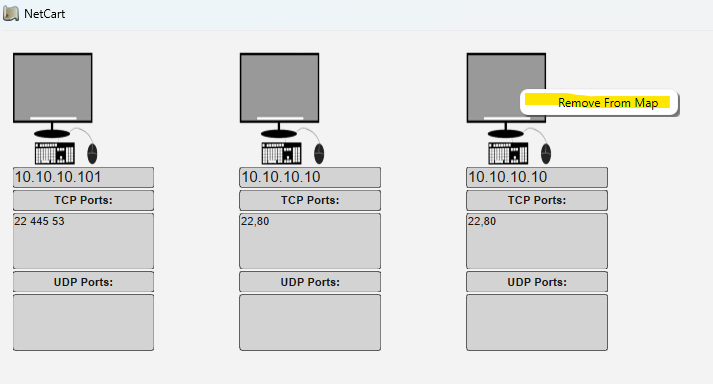
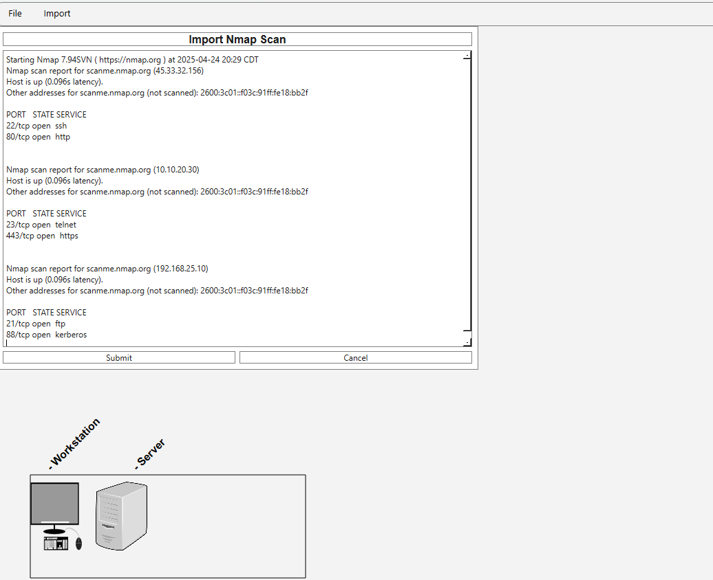

# NetCart
Network Cartographer - network mapping tool

## Table of Contents
- [Intro](#intro)
- [Installation](#installation)
- [Usage](#usage)

## Intro
NetCart is a gui-based tool designed to simplify the creation of network maps when mapping or enumerating a network. This tool addresses the specific need for cyber security/networking professionals to have a solid understanding of the layout of their networks. NetCart can be used in conjunction with other tools such as Nmap and NetCat to scan networks for host/port discovery to create a visual representation based on the scan results. 

## Installation
1. Launch the Exectuable
 - The NetCart exectuble can be found under releases along with the network_db.json file. 
 - Optionally, you can edit the network_db.json to pre-load resources onto your network map
 - The json is pre-loaded with sample data 

## Usage
1. Download the executable and json file as mentioned above.
2. Ensure that the network_db.json file is in the same directory as the exectuable.
3. Launch the exectuable.
4. Conduct network scans or obtain network information to update the map.
5. Any changes made to the map will be saved to the network_db.json automatically

### Adding Network Objects
1. Simply right-click inside of the window and specify the type of network object you'd like to add. 

### Removing Network Objects
1. Simply right-click inside of any of the icons select Remove from Map to remove it from the map.

### Importing Nmap Scans
1. In the menu bar, select "Import" and "Import Nmap Scan"
2. Paste your Nmap scan output into the text field and hit submit
3. The IPs and ports detected will be displayed on the map

